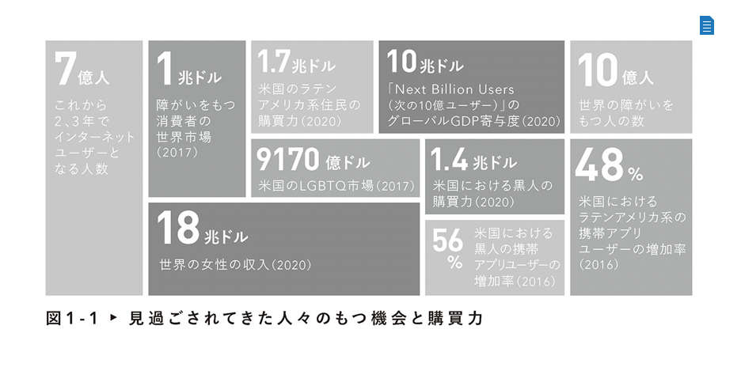

インクルーシブなプロダクト、サービスを開発するぞ！と時に、会社のリーダからメンバー、協力会社までみんなが読んでおくと良さそうな本。

Googleがインクルーシブな製品を開発することをどう考えていて、実際のプロダクトにどのように反映たかが、再現性のある形でまとめられていて、これからインクルーシブなプロダクト開発に取り組もうと思っている会社、チーム、人の足掛かりなると思う。

OKRを実践しているGoogleなので、インクルーシブについても定量的に測定できるようにしているところがなるほどだなと思った。
インクルーシブなプロダクト開発を進めることで、これまで未開拓の顧客に訴求できるようになるということで、具体的な数字がたくさん出ていて、数字で全てを語ることはよくないと思うが、すごくわかりやすい資料だった。

また、「AIに関わるリーダーはインクルージョンを優先する」というコラムがすごく興味深かった。

> 一般的には考慮されないユーザーに意識的に焦点を置いたうえで共感すること、そして人間を中心に据えることを私たちが忘れてしまったら、そうしたユーザーはテクノロジーの潜在的なバイアスの影響を受ける可能性が高くなります。

機械学習もの学習に使うデータに偏っていると、その学習結果を使うサービスは全て偏った結果を生むということは機械学習の研究者以外の理解しておいた方がいい。自分たちが開発したモデルにどういう偏りが含まれている可能性があるかを把握した上で使わないといけないし、場合によっては偏りがなくなるように再学習させる必要がある。
